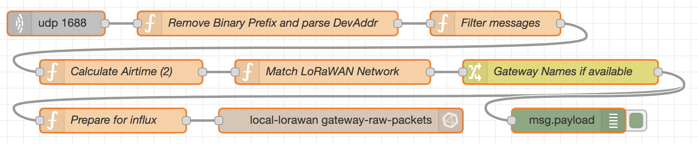
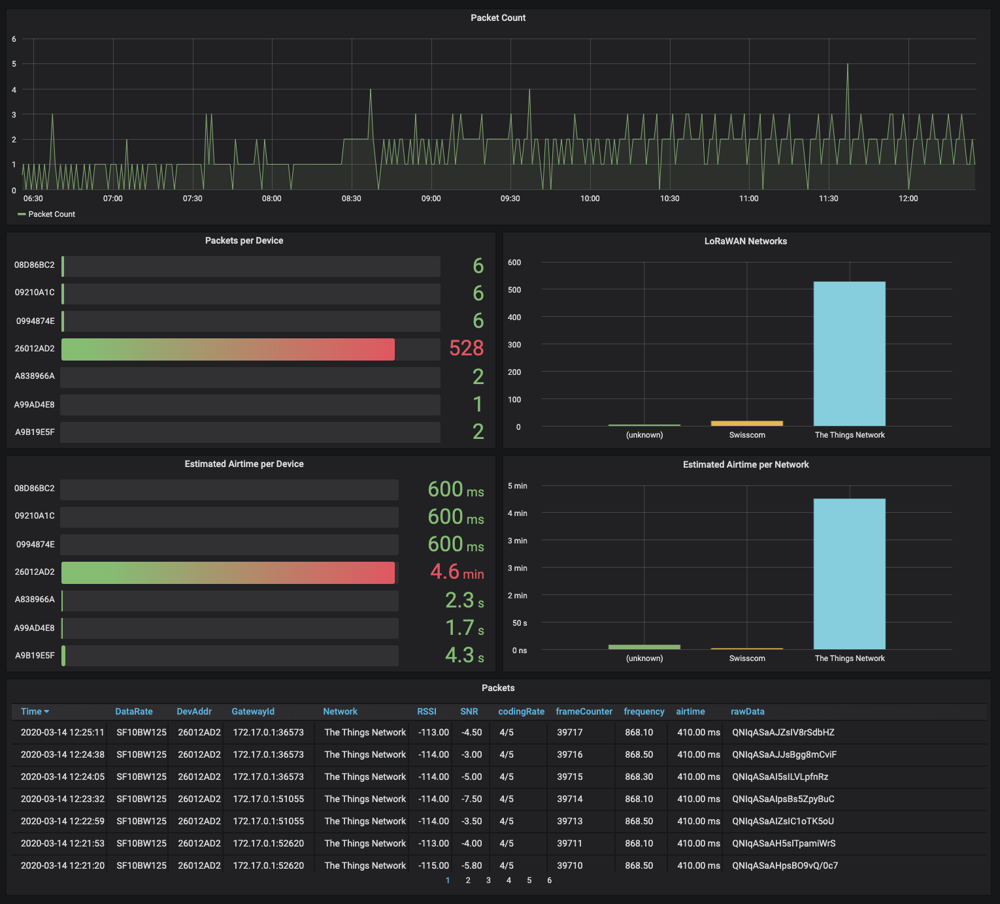

# LoRaWAN Gateway Traffic Analysis

A Node-Red flow to analyze the LoRaWAN packets your gateway(s) receive.



This flow acts like a LoRaWAN network for your gateway, takes in packages via the Semtech UDP protocol, calculates the airtime, figures out which network the package belongs to, and then stores all that information in an InfluxDB. You can then use Grafana to visualize that information



## Setup
* Install Node-Red with the [InfluxDB nodes](https://flows.nodered.org/node/node-red-contrib-influxdb)
* Use the "Import" function in the Node-Red menu to import the ``flows.json`` file.
* Enter the InfluxDB credentials in the last node.
* Enter your gateway EUIs in the "Gateway Names if available" node.
* Setup Grafana, configure the InfluxDB datasource, and import the ``dashboard.json`` file.
* Configure your Node-Red installation as an additional server in the [mp_pkt_fwd](https://github.com/kersing/packet_forwarder/tree/master/mp_pkt_fwd), by adding something like this section in the ``gateway_conf -> servers`` section:
```
{
    "server_address": "nodered.example.com",
    "serv_enabled": true,
    "serv_down_enabled": false,
    "serv_port_up": 1688,
    "serv_port_down": 1688
}
```
Or if you're using the balena.io image for your gateway(s), add the following Service Variables:
```
SERVER_1_ADDRESS=nodered.example.com
SERVER_1_ENABLED=true
SERVER_1_PORTDOWN=1688
SERVER_1_PORTUP=1688
```

## References
* Michael Enslin for the idea and the main nodes
* https://github.com/avbentem/lorawan-airtime-ui for the Airtime calculation
